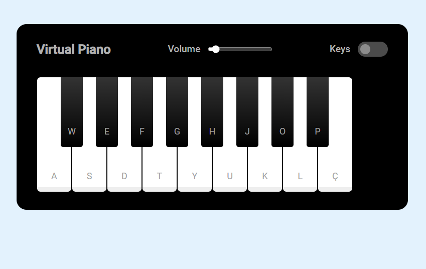

# Piano-Game
>Desenvolvimento de Jogos - DIO

# Índice

* [1. Resumo do projeto](#1-resumo-do-projeto)
* [2. Deploy](#2-deploy)
* [3. Tecnologias Utilizadas](#3-tecnologias-utilizadas)

## 1. Resumo do projeto📝
Projeto desenvolvido para o curso de Desenvolvimento de Jogos com JavaScript da DIO em parceria com Ifood e Potencia Tech. Foi desenvolvido um simulador de piano, onde o usuario pode tocar clicando com mouse ou apertando teclas do teclado. Divirta-se!

## 2. Deploy📝
### 📎[Acesse aqui]()

## 3. Tecnologias Utilizadas✅ 
    

